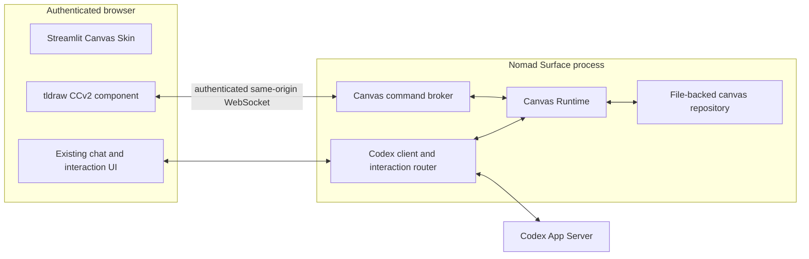

# Canvas Skin Architecture

## Status

This document records the architecture for integrating tldraw with Codex Nomad
Surface. A working prototype now implements the initial vertical slice; later
sections also describe the intended production design where noted.

The design follows the project constraints in [SPEC.md](../SPEC.md): keep the
system small, mobile-friendly, authenticated, directly connected to the current
Codex App Server API, and divided cleanly between UI and Codex integration.

### Implemented prototype slice

- `New chat...` shows a **Start canvas** action.
- Starting it creates a non-ephemeral App Server thread with the experimental
  `canvas` Dynamic Tools namespace.
- The Canvas Skin mounts tldraw through a packaged Streamlit CCv2 component.
- A same-origin WebSocket brokers `read_scene` and bounded `apply_patch` calls.
- The editable tldraw snapshot, SVG preview, manifest, and bounded revisions
  are saved atomically under `.nomad_surface/canvases/`.
- Empty Canvas threads are restored from their manifests even before their
  first Codex turn appears in `thread/list`.
- Document JSON and SVG are downloadable from the Canvas Skin.

The prototype does not yet implement asset ingestion, PNG rendering, command
receipt files, fork-copy behavior, or the full proposed operation vocabulary.
Before production distribution, the tldraw production-license prompt visible
in the editor must also be resolved under the chosen tldraw license.

## Decision Summary

- A Canvas Skin task opens directly into a canvas. It is not launched from a
  mid-conversation suggestion or modal.
- One Canvas Skin task has one Codex thread and one canvas.
- tldraw is embedded in Nomad Surface with the tldraw SDK.
- The editor is a packaged Streamlit Custom Component v2 implemented with
  React and TypeScript.
- Live canvas traffic uses a same-origin authenticated WebSocket, not
  Streamlit reruns.
- The Canvas Runtime runs inside the existing Nomad Surface process.
- Codex accesses the canvas through a small structured tool contract supplied
  through Codex App Server Dynamic Tools.
- Canvas state is file-backed. SQLite is not part of the initial design or
  prototype.
- tldraw offline is a design reference and possible interoperability target,
  not a runtime dependency.
- A tldraw sync server is not required for the initial single-user plus Codex
  collaboration model.

## Goals

- Let the user and Codex work on the same live diagram.
- Make the canvas the primary mobile operation surface.
- Preserve the existing chat, streaming, approval, and structured-interaction
  behavior instead of rebuilding it inside the tldraw component.
- Keep every canvas available as normal files that can be inspected, backed up,
  downloaded, or supplied to another workflow.
- Make Codex edits reviewable and reversible with normal tldraw undo behavior.
- Remain recoverable after browser refreshes, process restarts, and interrupted
  tool calls.

## Non-Goals

- General multi-user collaboration with presence and remote cursors.
- Treating tldraw Desktop or tldraw offline as a required backend.
- Giving Codex arbitrary JavaScript execution inside the editor.
- Running document-provided scripts automatically.
- Reimplementing the full Codex chat and approval UI in React.
- Adding a database before file-based storage is shown to be insufficient.
- Adding a legacy App Server fallback if Dynamic Tools are unavailable.

## User Experience

Canvas Skin is selected when creating or opening a Canvas task. The canvas is
shown immediately from the beginning of the task.

On a phone, the canvas occupies the main screen and the existing Streamlit chat
surface opens as a drawer or dialog. On a wider screen, chat may be displayed in
a collapsible side panel. These are two responsive presentations of the same
task and thread.

The tldraw component owns canvas interaction only. Streamlit continues to own:

- chat history and input;
- streamed Codex output;
- approvals and other response-required App Server interactions;
- task navigation and authentication;
- file download and revision controls.

This separation avoids duplicating Codex protocol handling in the frontend
component while still presenting chat as part of the Canvas Skin experience.

## System Architecture



The normal deployment therefore has two existing process boundaries:

1. Nomad Surface, containing Streamlit and the Canvas Runtime.
2. Codex App Server.

It does not add a permanently running tldraw Desktop process, Node service,
SQLite service, or tldraw sync service.

## Component Responsibilities

### Streamlit Canvas Skin

- Creates or opens the task and binds its thread to a canvas.
- Mounts the packaged Custom Component v2 editor.
- Presents the existing chat and response-required UI.
- Presents connection, save, export, revision, and recovery status.
- Supplies only mount configuration and low-frequency UI events to the custom
  component through the CCv2 interface.

### tldraw Custom Component

- Owns the live tldraw editor and its in-browser store.
- Connects to the Canvas Runtime over a same-origin WebSocket after
  authentication.
- Produces document snapshots and rendered previews.
- Applies validated Codex operations as one editor transaction and one undo
  unit.
- Assigns valid tldraw record IDs to newly created objects.
- Creates real bindings for meaningful connectors.
- Keeps camera, zoom, selection, and active-tool state local to the browser.

High-frequency editor changes must not use `setStateValue` or
`setTriggerValue`, because each event may cause a Streamlit rerun. Those APIs
remain appropriate for low-frequency component state and user actions.

### Canvas Runtime

- Authorizes the canvas connection against the current user and task.
- Maps the current thread to its deterministic canvas location.
- Coordinates reads, Codex command application, save checkpoints, and exports.
- Maintains one in-process lock per active canvas.
- Enforces operation limits, revision checks, and idempotent command IDs.
- Persists document files atomically.
- Returns a clear `canvas_unavailable` result instead of leaving an App Server
  tool call waiting indefinitely.

### Canvas Command Broker

- Tracks the active browser connection for each canvas.
- Sends structured read or apply requests to the live editor.
- Correlates replies by request ID.
- Applies bounded timeouts and disconnect handling.
- Contains no tldraw document logic of its own.

### Codex Interaction Router

The current generic handling of App Server requests should be extended into an
interaction router that distinguishes at least:

- approvals;
- user-input requests;
- canvas Dynamic Tool calls;
- unknown response-required requests.

Canvas handling is isolated behind an adapter because Codex App Server Dynamic
Tools are currently experimental. The project should use the current API
directly and report an explicit unsupported state if it is unavailable; it
should not add a legacy transport fallback.

## Codex Tool Contract

The initial Canvas Skin exposes only two dynamic tools.

### `canvas.read_scene`

Returns a compact semantic representation rather than the complete raw tldraw
store by default.

The result includes:

- canvas ID and revision;
- page information;
- shape IDs, types, bounds, and text;
- groups and parent-child relationships;
- bindings and connector endpoints;
- optionally the current selection or viewport subset;
- file references for the latest document and preview.

When the live editor is disconnected, this tool may read the most recent saved
document. Its result must state that it is a saved checkpoint rather than live
state.

### `canvas.apply_patch`

Accepts a bounded, typed batch of document operations:

- create;
- update;
- move;
- resize;
- delete;
- connect and disconnect;
- group and ungroup;
- reorder.

Each request includes:

- a unique command ID;
- the revision on which the command was planned;
- an ordered list of operations.

New shapes use temporary logical references in the request. The live editor
allocates tldraw IDs and returns the reference-to-ID mapping. The tool does not
accept raw JavaScript.

`canvas.apply_patch` requires an active editor in the initial architecture. If
the editor is disconnected, the tool returns `canvas_unavailable`; Nomad
Surface does not introduce a separate headless tldraw process merely to apply
the command.

## Command Flow

1. The user sends a message through the Canvas Skin chat.
2. Codex calls `canvas.read_scene` through an App Server Dynamic Tool request.
3. The interaction router sends the request to the Canvas Runtime.
4. The Runtime reads the live editor through the broker, or the latest saved
   checkpoint when a live read is not required.
5. Codex calls `canvas.apply_patch` with the observed base revision.
6. The Runtime rejects a stale revision or forwards the command to the editor.
7. The editor validates and applies the batch as one undoable transaction.
8. The updated document is checkpointed immediately.
9. The tool result returns the resulting revision, changed IDs, logical-ID
   mapping, warnings, and current file references.
10. Codex continues the same turn and explains the completed change.

## File-Backed Storage

Canvas content is stored outside app settings and outside a database. An
illustrative layout is:

```text
/path/to/nomad-data/canvases/<canvas-id>/
├── manifest.json
├── current/
│   ├── document.json
│   ├── preview.svg
│   └── preview.png
├── assets/
│   └── <content-hash>.<extension>
├── revisions/
│   └── <revision>/
│       ├── document.json
│       └── metadata.json
└── commands/
    └── <command-id-hash>.json
```

### Canonical and Derived Files

- `document.json` is the canonical editable tldraw document snapshot.
- `preview.svg` is the preferred always-addressable visual representation.
- `preview.png` is a derived thumbnail or compatibility image.
- `assets/` contains validated image and media files referenced by the document.
- A self-contained `.tldraw` file is generated on demand for interchange rather
  than rewritten after every editor change.
- Camera, zoom, selection, and active-tool state are not part of the canonical
  shared document.

The browser may use IndexedDB as a local cache, but the latest committed file
revision on the Nomad Surface host is the durability authority.

### Identity and Lookup

The canvas directory name is derived deterministically from the thread ID with
a path-safe stable hash. `manifest.json` stores the original thread ID and the
current revision. This removes the need for a central thread-to-canvas database
or mutable global index.

A fork receives a new thread ID and therefore a new canvas directory. Its first
revision is copied from the source canvas checkpoint. Archiving a task preserves
its canvas files.

### Manifest

An illustrative manifest is:

```json
{
  "schema_version": 1,
  "canvas_id": "canvas-abcd",
  "thread_id": "thread-123",
  "current_revision": 42,
  "document": "current/document.json",
  "preview": "current/preview.svg",
  "updated_at": "2026-08-15T12:34:56Z"
}
```

Paths in the manifest are relative to the canvas directory. User-provided path
segments are never accepted.

### Atomic Commit

A document commit follows this sequence:

1. Acquire the in-process canvas lock.
2. Compare `base_revision` with the manifest revision when the write comes from
   a Codex command.
3. Write the new revision into a temporary directory.
4. Validate that the snapshot is readable.
5. Atomically move the completed revision into `revisions/`.
6. Atomically replace `current/document.json` and `manifest.json`.
7. Record the command receipt under `commands/` when applicable.
8. Generate or replace SVG and PNG previews.

The document commit succeeds independently of preview rendering. A preview
failure is visible and retryable but does not invalidate the editable document.
On startup, incomplete temporary files are ignored and the last complete
revision is used for recovery.

### Save Triggers

- User document changes are saved with a short debounce.
- A Codex transaction is saved immediately before its tool call completes.
- Explicit save, export, task close, and archive actions flush pending changes.
- A file-download request first asks the active editor to flush. If the editor
  is disconnected, the endpoint serves the latest committed revision and marks
  it accordingly.

## Concurrency and Idempotency

The initial deployment is a single Nomad Surface process, so a per-canvas
in-process lock is sufficient for writes.

Every Codex apply request has a command ID. The corresponding receipt file
makes retries idempotent: a repeated command returns the stored result instead
of applying the operations again.

Optimistic revision checks protect user edits:

1. Codex reads revision 42.
2. The user changes the canvas, producing revision 43.
3. A Codex patch based on revision 42 receives `revision_conflict`.
4. Codex reads the new scene and plans a new patch.

SQLite or another transactional service should be reconsidered only if the app
moves to multiple writer processes, large cross-canvas queries, complex sharing
permissions, or a scale at which directory lookup is demonstrated to be a
problem.

## Authentication and Safety

- Canvas HTTP and WebSocket endpoints are same-origin and pass through the
  existing Nomad Surface authentication boundary.
- No document, preview, connection detail, or canvas existence information is
  exposed before authentication.
- Canvas IDs and thread ownership are checked on every request.
- File downloads use authenticated routes rather than a public static
  directory.
- Operation count, payload size, shape type, asset type, and asset size are
  bounded.
- External asset URLs are not fetched without an explicit controlled import
  path.
- Arbitrary JavaScript and document scripts are not accepted from Codex or
  imported for automatic execution.
- Destructive operations may require confirmation, while ordinary additive
  changes may be applied automatically and remain undoable.

## Failure Behavior

- **Browser disconnect:** fail pending apply calls promptly with
  `canvas_unavailable`; retain the last committed checkpoint.
- **Stale revision:** return `revision_conflict` and the current revision.
- **Repeated command:** return the existing command receipt.
- **Preview failure:** keep the document commit and expose a retryable warning.
- **Corrupt current pointer:** recover from the highest complete validated
  revision.
- **Unsupported Dynamic Tools:** keep manual canvas editing available, expose a
  clear Codex-canvas integration error, and do not silently use a legacy
  fallback.
- **Component refresh:** reload the committed document, reconnect the broker,
  and reconcile any command whose receipt already exists.

## Relationship to tldraw Offline

tldraw offline demonstrates a useful local-agent pattern: an agent reads the
live document, makes targeted changes with stable IDs and real bindings, and
persists the result as a file.

Canvas Skin adopts these principles:

- read before write;
- stable identities;
- real connector bindings;
- batch edits and undo;
- files as durable, inspectable artifacts;
- targeted changes rather than clear-and-redraw behavior.

It does not adopt tldraw offline's trusted local execution boundary. Nomad
Surface is a remotely accessible authenticated web surface, so arbitrary editor
JavaScript, automatic document scripts, and a Desktop-local HTTP server are not
appropriate runtime contracts.

tldraw offline may later be used as:

- an interoperability target for exported `.tldraw` files;
- a manual behavior reference;
- a development-only test oracle for diagram quality.

It is not a production fallback or required service.

## When a Separate Sync Service Becomes Appropriate

A self-hosted tldraw sync service should be considered only when the product
requires true multi-user collaboration, including multiple simultaneous human
editors, presence, remote cursors, or multiple Nomad Surface writer instances.

Codex does not need to be modeled as a second tldraw network client in the
initial design. The Canvas Runtime brokers Codex commands into the user's live
editor, which keeps the system smaller and avoids premature multiplayer
infrastructure.

## Delivery Sequence

1. Prove that a packaged CCv2 tldraw component can mount, read a scene, and
   apply one typed batch.
2. Add the authenticated same-origin WebSocket and Canvas Runtime.
3. Add file-backed snapshots, revisions, previews, and recovery.
4. Add the App Server interaction router and the two Dynamic Tools.
5. Add the mobile chat drawer and wider-screen side panel.
6. Add fork, archive, export, asset ingestion, and destructive-operation policy.
7. Reconsider sync infrastructure or a database only after a concrete new
   requirement or measured limitation appears.

## External References

- [Codex App Server Dynamic Tools](https://learn.chatgpt.com/docs/app-server#dynamic-tool-calls-experimental)
- [Streamlit Custom Components v2](https://docs.streamlit.io/develop/api-reference/custom-components/st.components.v2.component)
- [tldraw persistence](https://tldraw.dev/docs/persistence)
- [tldraw collaboration](https://tldraw.dev/docs/collaboration)
- [tldraw offline](https://offline.tldraw.com/)
