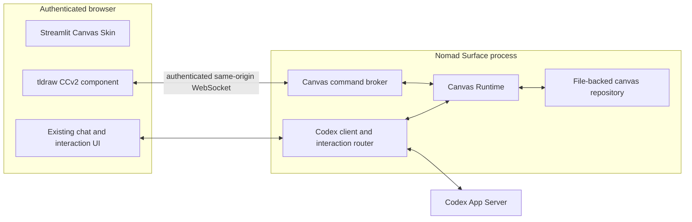

# Canvas Skin Architecture

## Status

This document records the architecture for integrating tldraw with Codex Nomad
Surface. A working prototype now implements the initial vertical slice; later
sections also describe the intended production design where noted.

The design follows the project constraints in [SPEC.md](../SPEC.md): keep the
system small, mobile-friendly, authenticated, directly connected to the current
Codex App Server API, and divided cleanly between UI and Codex integration.

### Implemented prototype slice

- `New chat...` shows a **Start canvas** action.
- Starting it creates a local Canvas draft. Its first message creates a
  non-ephemeral App Server thread and starts the first turn on the same
  connection with the experimental `canvas` Dynamic Tools namespace.
- Before that first turn, Nomad Surface adds one Canvas-scoped developer
  context item through `thread/inject_items`. It preserves the App Server's
  existing instructions while telling Codex to use the embedded Canvas tools
  instead of backing files or unrelated offline integrations.
- The Canvas Skin mounts tldraw through a packaged Streamlit CCv2 component.
- A same-origin WebSocket brokers `read_scene`, bounded `apply_patch`, and
  managed Obsidian `export` calls.
- `apply_patch` exposes closed schemas for create, update, move, resize, delete,
  and connect. The browser validates and normalizes the complete batch before
  writing, then applies it as one undoable transaction with rollback on error.
- The editable tldraw snapshot, SVG preview, manifest, and bounded revisions
  are saved atomically under `.nomad_surface/canvases/`.
- Successful apply commands persist hashed, versioned receipts. Repeated
  commands replay the committed result, conflicts fail closed, and missing
  receipts can be reconstructed from bounded revision metadata.
- A Canvas is bound to its App Server thread after the first turn starts.
- Canvas drafts are restored from their manifests after a browser refresh or
  process restart, even before they have an App Server thread.
- Canvas manifests created by the earlier prototype remain usable: if their
  empty thread has no rollout, the first message creates and binds a replacement
  thread without replacing the drawing files.
- Obsidian tldraw Markdown and SVG are downloadable from the Canvas Skin;
  canonical Document JSON remains an internal persistence format.
- User paste, drop, and file selection share a bounded Canvas asset upload
  path. Static JPEG, PNG, and WebP inputs are converted to content-addressed
  WebP assets; oversized, animated, unsupported, or insufficiently compressible
  images fail without adding a shape. The resulting tldraw asset record uses
  the optimized WebP's actual name, MIME type, dimensions, and byte size so
  snapshots and Obsidian exports do not retain stale source metadata.
  Browser batches are limited to two files, while the server admits at most
  two image uploads from receipt through conversion at once and rejects excess
  work before reading its request body.
- `canvas.apply_patch` provides a `create_image` operation for a file inside the
  current project. Its `path` may be absolute or project-relative. It uses the
  same optimizer and commit barrier as user-added images; raw tldraw image
  records are not part of the tool contract. This path-based Codex operation
  requires Nomad Surface and Codex App Server to share the same host filesystem;
  Codex image insertion from a separate host is not currently supported.
- On wider screens, the canvas remains fixed in the viewport while chat history
  scrolls independently in a right-side panel; the native `st.chat_input` sits
  at the bottom of that panel so the canvas can use the full remaining height.
- The Canvas chat keeps a small, code-defined number of completed messages
  visible. That stable history is separate from the live-turn fragment, which
  continues to show the active prompt, progress, approvals, and final response
  without polling and redrawing the completed history.
- Canvas metadata and export actions are kept in a compact disclosure.

The prototype does not yet implement fork-copy behavior or the full proposed
operation vocabulary beyond the current bounded operations.
Before production distribution, the tldraw production-license prompt visible
in the editor must also be resolved under the chosen tldraw license.

## Decision Summary

- A Canvas Skin task opens directly into a canvas. It is not launched from a
  mid-conversation suggestion or modal.
- One Canvas Skin task has one Codex thread and one canvas.
- tldraw is embedded in Nomad Surface with the tldraw SDK.
- The editor is a packaged Streamlit Custom Component v2 implemented with
  React and TypeScript.
- Live canvas traffic uses a same-origin authenticated WebSocket, not
  Streamlit reruns.
- The Canvas Runtime runs inside the existing Nomad Surface process.
- Codex accesses the canvas through a small structured tool contract supplied
  through Codex App Server Dynamic Tools.
- Canvas state is file-backed. SQLite is not part of the initial design or
  prototype.
- tldraw offline is a design reference and possible interoperability target,
  not a runtime dependency.
- A tldraw sync server is not required for the initial single-user plus Codex
  collaboration model.

## Goals

- Let the user and Codex work on the same live diagram.
- Make the canvas the primary mobile operation surface.
- Preserve the existing chat, streaming, approval, and structured-interaction
  behavior instead of rebuilding it inside the tldraw component.
- Keep every canvas available as normal files that can be inspected, backed up,
  downloaded, or supplied to another workflow.
- Make Codex edits reviewable and reversible with normal tldraw undo behavior.
- Remain recoverable after browser refreshes, process restarts, and interrupted
  tool calls.

## Non-Goals

- General multi-user collaboration with presence and remote cursors.
- Treating tldraw Desktop or tldraw offline as a required backend.
- Giving Codex arbitrary JavaScript execution inside the editor.
- Running document-provided scripts automatically.
- Reimplementing the full Codex chat and approval UI in React.
- Adding a database before file-based storage is shown to be insufficient.
- Adding a legacy App Server fallback if Dynamic Tools are unavailable.

## User Experience

Canvas Skin is selected when creating or opening a Canvas task. The canvas is
shown immediately from the beginning of the task.

On a phone, the canvas occupies the main screen and the existing Streamlit chat
surface may open as a drawer or dialog. On a wider screen, chat is displayed in
an independently scrolling side panel so the canvas itself does not move with
chat history. These are two responsive presentations of the same task and
thread.

The tldraw component owns canvas interaction only. Streamlit continues to own:

- chat history and input;
- streamed Codex output;
- approvals and other response-required App Server interactions;
- task navigation and authentication;
- file download and revision controls.

This separation avoids duplicating Codex protocol handling in the frontend
component while still presenting chat as part of the Canvas Skin experience.

## System Architecture



The normal deployment therefore has two existing process boundaries:

1. Nomad Surface, containing Streamlit and the Canvas Runtime.
2. Codex App Server.

It does not add a permanently running tldraw Desktop process, Node service,
SQLite service, or tldraw sync service.

## Component Responsibilities

### Streamlit Canvas Skin

- Creates or opens the task and binds its thread to a canvas.
- Mounts the packaged Custom Component v2 editor.
- Presents the existing chat and response-required UI.
- Presents connection, save, export, revision, and recovery status.
- Supplies only mount configuration and low-frequency UI events to the custom
  component through the CCv2 interface.

### tldraw Custom Component

- Owns the live tldraw editor and its in-browser store.
- Connects to the Canvas Runtime over a same-origin WebSocket after
  authentication.
- Produces document snapshots and rendered previews.
- Sends lightweight document-only checkpoints during editing and refreshes the
  rendered preview after a longer idle period.
- Skips a document-only checkpoint when it matches the last document sent for
  persistence or acknowledged as a committed Codex operation; preview refreshes
  and reconnect snapshots still run.
- Applies validated Codex operations as one editor transaction and one undo
  unit.
- Holds that transaction behind a short read-only commit barrier. The Runtime
  acknowledges it only after the revision and receipt are durable. If the
  acknowledgement is lost, reconnect/status checks reconcile the receipt
  before the editor commits or rolls back its mark.
- Assigns valid tldraw record IDs to newly created objects.
- Creates real bindings for meaningful connectors.
- Keeps camera, zoom, selection, and active-tool state local to the browser.

High-frequency editor changes must not use `setStateValue` or
`setTriggerValue`, because each event may cause a Streamlit rerun. Those APIs
remain appropriate for low-frequency component state and user actions. The
current Canvas component sends snapshots directly over its WebSocket and emits
no Streamlit state while the user is editing. Connection status and retries
remain local to the component so they do not rerun the Streamlit application.

### Canvas Runtime

- Authorizes the canvas connection against the current user and task.
- Maps the current thread to its deterministic canvas location.
- Coordinates reads, Codex command application, save checkpoints, and exports.
- Maintains one in-process lock per active canvas.
- Enforces operation limits, revision checks, and idempotent command IDs.
- Persists document files atomically.
- Returns a clear `canvas_unavailable` result instead of leaving an App Server
  tool call waiting indefinitely.

### Canvas Command Broker

- Tracks the active browser connection for each canvas.
- Keeps only the most recently connected editor writable and retires an older
  connection when the same canvas is opened again.
- Sends structured read or apply requests to the live editor.
- Correlates replies by request ID.
- Applies bounded timeouts and disconnect handling.
- Contains no tldraw document logic of its own.

### Codex Interaction Router

The current generic handling of App Server requests should be extended into an
interaction router that distinguishes at least:

- approvals;
- user-input requests;
- canvas Dynamic Tool calls;
- unknown response-required requests.

Canvas handling is isolated behind an adapter because Codex App Server Dynamic
Tools are currently experimental. The project should use the current API
directly and report an explicit unsupported state if it is unavailable; it
should not add a legacy transport fallback.

For a newly created Canvas thread, the router injects one short developer
message before its first user turn. The message defines only the general Canvas
interaction policy; geometry and other scene facts remain tool results. It is
not repeated on resumed turns, and it does not replace the selected Codex
collaboration mode or its built-in instructions.

## Codex Tool Contract

The Canvas Skin exposes three dynamic tools.

### `canvas.read_scene`

Returns a bounded semantic representation for an `all`, `viewport`,
`selection`, `bounds`, `frame`, or `shape_ids` scope rather than relying on the
raw tldraw store alone. Detail can be `compact`, `standard`, or bounded `full`.
Codex uses an optional scope-specific image for visual composition and the
structured scene for exact object identity and geometry.

The result includes:

- canvas ID and revision;
- page information;
- shape IDs, types, bounds, and text;
- groups and parent-child relationships;
- bindings and connector endpoints;
- explicit truncation counts and a narrower-scope suggestion;
- file references for the latest document and preview.
- an optional `inputImage` content item containing only the requested scope.

When the live editor is disconnected, this tool may read the most recent saved
document. Its result must state that it is a saved checkpoint rather than live
state. `viewport` and `selection` require a live editor; saved checkpoints can
resolve `frame` and `shape_ids`, `all` for a single-page checkpoint, and
`bounds` when every saved shape has directly resolvable page-space geometry.
Ambiguous page or bounds reads fail closed and require the live editor. A
scoped offline read never substitutes an unrelated whole-canvas preview. Raster
export or validation failure never blocks the canonical document or SVG save;
the result reports that the visual preview is unavailable instead.

### `canvas.apply_patch`

Accepts a bounded, typed batch of document operations:

- create;
- draw freehand marks, highlights, and polylines from absolute Canvas points;
- update;
- move;
- resize;
- delete;
- connect and disconnect;
- group and ungroup;
- reparent and reorder;
- rotate and flip;
- align, distribute, stack, and pack.

Each request includes:

- a unique command ID;
- the revision on which the command was planned;
- an ordered list of operations.

New shapes use temporary logical references in the request. The live editor
allocates tldraw IDs and returns the reference-to-ID mapping. The tool does not
accept raw JavaScript.

Drawing input stays independent of tldraw's stored stroke encoding. Codex sends
ordinary `{x, y, pressure?}` points in page space with a `freehand`, `highlight`,
or `line` kind. The browser converts them to local coordinates and uses tldraw's
public point and index encoders. Raw `segments`, base64 paths, and shape records
are not part of the tool contract.

`canvas.apply_patch` requires an active editor in the initial architecture. If
the editor is disconnected, the tool returns `canvas_unavailable`; Nomad
Surface does not introduce a separate headless tldraw process merely to apply
the command.

The `create_image` path contract also assumes that Nomad Surface and Codex App
Server run on hosts that share the Canvas project filesystem. Browser uploads
continue to use the authenticated Canvas HTTP endpoint, but a Codex App Server
on a separate host cannot currently transfer an image into Canvas. Supporting
that deployment would require a separate authenticated, bounded binary upload
and asset-reference protocol; embedding Base64 file data in Dynamic Tool JSON
is intentionally not used as a fallback.

### `canvas.export`

Serializes the current live editor as Obsidian tldraw Markdown and atomically
saves it under the Canvas-managed `exports/` directory. Codex uses this tool
after completing requested edits when the user asks to save or export the
diagram in Obsidian format. It accepts only the closed `obsidian` format and
does not accept an arbitrary output path.

The browser-side serializer is shared with the mobile Download action, so both
paths produce the same portable `TldrawFile` payload and embedded assets. The
tool requires an active editor, returns the saved path, size, and content hash,
and does not trigger a download on the user's device.

### Semantic identity, provenance, and lint

Domain shapes and semantic connectors may carry metadata under `meta.nomad`.
The namespace contains `schema_version`, a document-unique `semantic_id`,
bounded `source_refs`, `created_by`, and `last_command_id`; updates merge this
namespace and preserve unrelated tldraw metadata. Semantic IDs use
`[A-Za-z0-9][A-Za-z0-9._:-]{0,127}`. Source references contain a document and
locator, with an optional label and `sha256:` content hash; they are descriptive
and are never dereferenced by the Canvas tool.

`created_by` is added to shapes created through the Canvas tool and preserved
thereafter. Updating a pre-existing shape does not invent creator attribution.

Mutation targets accept exactly one tldraw ID, semantic ID, or earlier
same-patch ref. Duplicate semantic IDs make semantic lookup ambiguous and fail
instead of selecting the first match; an exact tldraw-ID patch may still repair
the duplicate, and final-state uniqueness is validated before apply. Scoped
reads return the tldraw ID and a bounded, validated `nomad` semantic summary so
later domain edits can use durable identity.

After fonts and geometry settle, a bounded, read-only lint pass checks semantic
identity, provenance, connector bindings, requested text height, node overlap,
and frame containment for changed shapes and their directly affected neighbors.
Structured lint entries are stored in the command receipt. `semantic_success`
is false when an identity or binding error remains; visual warnings do not roll
back a valid edit.

## Command Flow

1. The user sends a message through the Canvas Skin chat.
2. For a new Canvas thread, Nomad Surface injects the Canvas interaction policy
   before starting the first user turn.
3. Codex calls `canvas.read_scene` through an App Server Dynamic Tool request.
4. The interaction router sends the request to the Canvas Runtime.
5. The Runtime reads the live editor through the broker, or the latest saved
   checkpoint when a live read is not required.
6. Codex calls `canvas.apply_patch` with the observed base revision.
7. The Runtime rejects a stale revision or forwards the command to the editor.
8. The editor validates and applies the batch as one rollback-capable
   transaction, then temporarily blocks local editing.
9. The updated document and command receipt are checkpointed immediately.
10. The Runtime acknowledges the commit. A rejection rolls the editor back;
    an uncertain disconnect is reconciled against the durable receipt before
    local editing resumes.
11. The tool result returns the resulting revision, changed IDs, logical-ID
   mapping, warnings, and current file references.
12. If the user requested an Obsidian file, Codex calls `canvas.export`; the
    live editor serializes the committed state and the Runtime atomically saves
    it to the managed exports directory.
13. Codex continues the same turn and explains the completed change and saved
    path.

## File-Backed Storage

Canvas content is stored outside app settings and outside a database. An
illustrative layout is:

```text
/path/to/nomad-data/canvases/<canvas-id>/
├── manifest.json
├── current/
│   ├── document.json
│   ├── preview.svg
│   └── preview.webp
├── assets/
│   └── <content-hash>.<extension>
├── exports/
│   └── <canvas-id>.md
├── revisions/
│   └── <revision>/
│       ├── document.json
│       └── metadata.json
└── commands/
    └── <command-id-hash>.json
```

### Canonical and Derived Files

- `document.json` is the canonical editable tldraw document snapshot.
- `preview.svg` is the preferred always-addressable visual representation.
- `preview.webp` is the bounded whole-canvas raster used for Codex visual
  recognition and as a compatibility image.
- `assets/` contains validated image and media files referenced by the document.
  The current limits are 10 MiB and 20 megapixels for a static source image,
  2048 px for its longest optimized edge, and 768 KiB for the stored WebP.
  Assets referenced by the current or retained revision documents are kept.
  Unreferenced uploads receive a short in-flight grace period and are then
  reclaimed before later asset quota checks without rescanning every retained
  document after each Canvas checkpoint.
- An Obsidian tldraw Markdown file containing a standard `TldrawFile` is
  generated on demand for device download or atomically saved under `exports/`
  when Codex calls `canvas.export`; it is not rewritten after every editor
  change.
- Camera, zoom, selection, and active-tool state are not part of the canonical
  shared document.

The browser may use IndexedDB as a local cache, but the latest committed file
revision on the Nomad Surface host is the durability authority.

### Identity and Lookup

The canvas directory name is derived deterministically from a local draft ID
with a path-safe stable hash. `manifest.json` stores that draft ID, the current
revision, and the App Server thread ID after the first turn starts. Existing
prototype canvases retain their original thread-derived directory names. A
manifest lookup keeps both layouts usable without moving drawing files or
introducing a central database.

A fork creates a new local Canvas draft ID and therefore a new canvas directory.
Its first revision is copied from the source canvas checkpoint; its App Server
thread ID is bound after the fork's first turn starts. Archiving a task preserves
its canvas files.

### Manifest

An illustrative manifest is:

```json
{
  "schema_version": 3,
  "canvas_id": "canvas-abcd",
  "draft_id": "local-draft-123",
  "thread_id": "thread-123",
  "current_revision": 42,
  "document": "revisions/00000042/document.json",
  "preview": "current/preview.svg",
  "content_hash": "document-sha256",
  "preview_content_hash": "document-sha256",
  "visual_preview_content_hash": "document-sha256",
  "updated_at": "2026-08-15T12:34:56Z"
}
```

Paths in the manifest are relative to the canvas directory. User-provided path
segments are never accepted. Offline reads expose a saved preview only when its
content hash matches the current document.

### File Commit

A document commit follows this sequence:

1. Acquire the in-process canvas lock.
2. Compare `base_revision` with the manifest revision when the write comes from
   a Codex command.
3. Create the next numbered revision directory, or reuse it if an interrupted
   save left it uncommitted.
4. Atomically replace the numbered revision document and metadata.
5. Atomically update the manifest last, making that immutable document current.
6. Best-effort materialize the `current/` compatibility cache while its old
   preview hashes keep those files unavailable.
7. Atomically publish hashes only for previews that were materialized.
8. Prune old revisions beyond the retention limit.

This intentionally uses individual atomic file replacements instead of a
cross-file transaction. The manifest is the commit authority: if a save stops
before step 5, readers continue using the preceding revision. A failure after
step 5 cannot turn a durable command into a negative acknowledgement; readers
resolve the document path from the manifest instead of depending on the cache.
An interrupted cache update leaves its preview unavailable rather than exposing
it for the wrong document. An interrupted pre-commit revision directory is
safely overwritten and completed by the next save.

### Save Triggers

- User document changes are saved with a short debounce.
- A Codex transaction is saved immediately before its tool call completes.
- Explicit save, task close, and archive actions flush pending changes.
- Obsidian export is serialized directly from the active editor so it contains
  its current records and portable assets. The canonical saved snapshot is not
  exposed as the user-facing interchange file.
- The mobile Download action and `canvas.export` share that serializer. Download
  writes to the user's device; `canvas.export` writes only to the bounded
  Canvas-managed exports directory.

## Concurrency and Idempotency

The initial deployment is a single Nomad Surface process, so a per-canvas
in-process lock is sufficient for writes.

Every Codex apply request has a command ID. The corresponding receipt file
makes retries idempotent: a repeated command returns the stored result instead
of applying the operations again. Every newly accepted command creates one
revision, including a command whose resulting document is unchanged; this
keeps receipt persistence on a single commit path.

Optimistic revision checks protect user edits:

1. Codex reads revision 42.
2. The user changes the canvas, producing revision 43.
3. A Codex patch based on revision 42 receives `revision_conflict`.
4. Codex reads the new scene and plans a new patch.

SQLite or another transactional service should be reconsidered only if the app
moves to multiple writer processes, large cross-canvas queries, complex sharing
permissions, or a scale at which directory lookup is demonstrated to be a
problem.

## Authentication and Safety

- Canvas HTTP and WebSocket endpoints are same-origin and pass through the
  existing Nomad Surface authentication boundary.
- Authenticated asset responses are not stored in the browser cache, so an
  expired authentication session cannot reuse a fresh immutable response.
- No document, preview, connection detail, or canvas existence information is
  exposed before authentication.
- Canvas IDs and thread ownership are checked on every request.
- File downloads use authenticated routes rather than a public static
  directory.
- Operation count, payload size, shape type, asset type, and asset size are
  bounded.
- External asset URLs are not fetched without an explicit controlled import
  path.
- Arbitrary JavaScript and document scripts are not accepted from Codex or
  imported for automatic execution.
- Destructive operations may require confirmation, while ordinary additive
  changes may be applied automatically and remain undoable.

## Failure Behavior

- **Uncertain browser disconnect:** keep the commit barrier active and reconcile
  the durable receipt after reconnecting; terminal connection failures reject
  the apply and retain the last committed checkpoint.
- **Concurrent request during commit:** return the retryable
  `canvas_commit_pending` error without exposing the uncommitted document.
- **Stale revision:** return `revision_conflict` and the current revision.
- **Repeated command:** return the existing command receipt.
- **Preview failure:** keep the document commit and expose a retryable warning.
- **Corrupt current pointer:** recover from the highest complete validated
  revision.
- **Unsupported Dynamic Tools:** keep manual canvas editing available, expose a
  clear Codex-canvas integration error, and do not silently use a legacy
  fallback.
- **Component refresh:** reload the committed document, reconnect the broker,
  and reconcile any command whose receipt already exists.

## Relationship to tldraw Offline

tldraw offline demonstrates a useful local-agent pattern: an agent reads the
live document, makes targeted changes with stable IDs and real bindings, and
persists the result as a file.

Canvas Skin adopts these principles:

- read before write;
- stable identities;
- real connector bindings;
- batch edits and undo;
- files as durable, inspectable artifacts;
- targeted changes rather than clear-and-redraw behavior.

It does not adopt tldraw offline's trusted local execution boundary. Nomad
Surface is a remotely accessible authenticated web surface, so arbitrary editor
JavaScript, automatic document scripts, and a Desktop-local HTTP server are not
appropriate runtime contracts.

tldraw offline may later be used as:

- a design reference alongside the standard `.tldr` interchange format;
- a manual behavior reference;
- a development-only test oracle for diagram quality.

It is not a production fallback or required service.

## When a Separate Sync Service Becomes Appropriate

A self-hosted tldraw sync service should be considered only when the product
requires true multi-user collaboration, including multiple simultaneous human
editors, presence, remote cursors, or multiple Nomad Surface writer instances.

Codex does not need to be modeled as a second tldraw network client in the
initial design. The Canvas Runtime brokers Codex commands into the user's live
editor, which keeps the system smaller and avoids premature multiplayer
infrastructure.

## Delivery Sequence

1. Prove that a packaged CCv2 tldraw component can mount, read a scene, and
   apply one typed batch.
2. Add the authenticated same-origin WebSocket and Canvas Runtime.
3. Add file-backed snapshots, revisions, previews, and recovery.
4. Add the App Server interaction router and the three Dynamic Tools.
5. Add the mobile chat drawer; the wider-screen side panel is implemented.
6. Add fork, archive, asset ingestion, and destructive-operation policy.
7. Reconsider sync infrastructure or a database only after a concrete new
   requirement or measured limitation appears.

## External References

- [Codex App Server Dynamic Tools](https://learn.chatgpt.com/docs/app-server#dynamic-tool-calls-experimental)
- [Codex App Server thread context injection](https://learn.chatgpt.com/docs/app-server#inject-items-into-a-thread)
- [Streamlit Custom Components v2](https://docs.streamlit.io/develop/api-reference/custom-components/st.components.v2.component)
- [tldraw persistence](https://tldraw.dev/docs/persistence)
- [tldraw collaboration](https://tldraw.dev/docs/collaboration)
- [tldraw offline](https://offline.tldraw.com/)
