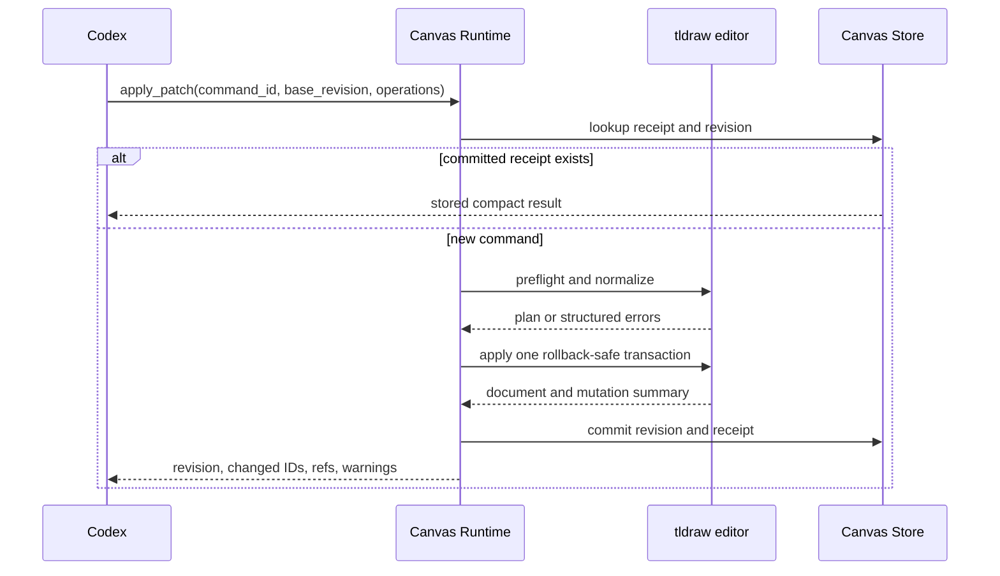

# Canvas Tooling Hardening Plan

## Status and scope

This document defines the implementation plan for the first three Canvas
improvements:

1. strict patch schemas, preflight validation, rollback, and command receipts;
2. compact apply results and scoped scene reads;
3. durable semantic IDs, source provenance, and diagram linting.

It does not cover automatic layout, a tldraw sync server, arbitrary JavaScript,
or the future page/group/reorder operation vocabulary. Those features should
build on the hardened contracts described here.

Phases 1 and 2 are implemented. Phase 3 remains planned work.

## Baseline before hardening

As of 2026-08-20, the Canvas component declares and locks tldraw SDK 5.3.1.

- `canvas.read_scene` has an empty input schema and reads the whole current
  page.
- `canvas.apply_patch` constrains the top-level request, but each operation
  defines only `op`; other fields are open-ended.
- The browser applies operations sequentially inside `Editor.run`. There is no
  mutation-free preflight or explicit rollback on a later operation failure.
- Apply constructs a full document, scene, SVG, and raster preview before
  returning, even though the model needs only a compact mutation result.
- New Codex shapes store `meta.logicalRef`, but later requests cannot address
  them by that reference.
- Revisions are persisted, but command receipt files are not implemented.

Primary implementation files:

- `codex_nomad_surface/canvas_runtime.py`
- `codex_nomad_surface/canvas_store.py`
- `components/nomad-canvas/nomad_canvas/frontend/src/NomadCanvas.tsx`
- `tests/test_canvas_store.py`
- `docs/canvas-skin-architecture.md`

## Target flow



The model-facing protocol is Nomad-owned. It is normalized into tldraw records
in the browser; raw tldraw records are not the command language.

---

## Phase 1: Typed and idempotent patch application

### Strict operation schemas

Replace the open-ended operation schema with a discriminated `oneOf`. Set
`additionalProperties: false` on every protocol-owned object.

Top-level constraints:

| Field | Constraint |
| --- | --- |
| `command_id` | Required string, 1–128 characters |
| `base_revision` | Required integer, minimum 0 |
| `operations` | Required array, 1–100 items |

Phase 1 types the existing operations only:

- `create`
- `update`
- `move`
- `resize`
- `delete`
- `connect`

Representative create request:

```json
{
  "op": "create",
  "ref": "diagnosis-gate",
  "shape": {
    "type": "geo",
    "x": 120,
    "y": 200,
    "width": 280,
    "height": 120,
    "text": "診断種別を判定",
    "style": {
      "geo": "diamond",
      "color": "blue",
      "fill": "semi",
      "dash": "solid",
      "size": "m"
    }
  }
}
```

Nomad fields such as `text`, `width`, and `height` are normalized to the
correct tldraw props. Callers do not submit `props.text`, raw rich-text JSON, or
arbitrary shape props. The supported type and style allowlists must be derived
from the built-in shape utilities used by the mounted editor and covered by
contract tests.

An `update` requires at least one of `x`, `y`, `width`, `height`, `text`,
`name`, or a non-empty `style` object.

Targets accept exactly one of:

```json
{"id": "shape:existing"}
```

```json
{"ref": "diagnosis-gate"}
```

`ref` is valid only inside the same patch. Phase 3 adds persistent
`semantic_id` lookup.

### Structured validation errors

```json
{
  "error": "patch_validation_failed",
  "operation_errors": [
    {
      "operation_index": 2,
      "path": "shape.props.text",
      "code": "unsupported_property",
      "message": "props.text is not supported.",
      "suggestion": "Use shape.text. It is converted to tldraw richText."
    }
  ]
}
```

Initial operation error codes:

- `invalid_operation`
- `unsupported_shape_type`
- `unsupported_property`
- `invalid_enum_value`
- `invalid_number`
- `duplicate_ref`
- `target_not_found`
- `target_locked`
- `target_type_mismatch`
- `connector_endpoint_not_found`

Callers branch on `code`; `message` and `suggestion` are explanatory.

### Mutation-free preflight

Extract protocol logic from `NomadCanvas.tsx`, for example:

```text
frontend/src/canvas-protocol/
├── types.ts
├── normalize.ts
├── validate.ts
├── apply.ts
└── lint.ts
```

`validatePatch(editor, request)` must, without any editor writes:

1. validate every operation DTO;
2. create the temporary-ref table and reject duplicates;
3. resolve all existing targets and connector endpoints;
4. reject locked mutation targets and verify expected target types;
5. normalize numbers, text, styles, and tldraw props;
6. allocate deterministic IDs;
7. return an immutable normalized plan.

tldraw store validation remains the final safety layer when normalized records
are written.

### Rollback-safe application

Before applying the normalized plan:

1. create a named history stopping point;
2. apply the complete plan inside one `Editor.run` call;
3. if any write throws, bail back to the mark;
4. keep the mark rollback-capable until the Runtime commits the revision and
   receipt;
5. use a commit acknowledgement, reconciling an uncertain disconnect or lost
   acknowledgement against the durable receipt before committing or rolling
   back;
6. return `patch_apply_failed`;
7. persist only after the complete batch succeeds.

A patch may report at most 500 unique changed shape IDs so its result remains
within the durable receipt contract.

A successful patch is one visible undo action. Rollback and persistence
bookkeeping must not add extra undo steps.

### Durable command receipts

Receipt paths use a hash of `command_id`; raw IDs are never path segments.

```json
{
  "schema_version": 1,
  "command_id": "diagram-20260820-001",
  "input_hash": "sha256:...",
  "base_revision": 11,
  "result_revision": 12,
  "changed_ids": ["shape:..."],
  "refs": {"diagnosis-gate": "shape:..."},
  "warnings": [],
  "committed_at": "2026-08-20T12:34:56Z"
}
```

Rules:

- Check receipts before the normal revision-conflict check.
- Same command ID and canonical input hash returns the stored result without a
  new revision.
- Every newly accepted command gets its own revision, even when its document is
  unchanged. This keeps receipt durability on the normal revision path.
- Same command ID with different input returns `command_id_conflict`.
- A receipt is valid only when its result revision is committed by the
  manifest.
- Store command ID, input hash, and result summary in revision metadata so a
  missing receipt can be reconstructed after a crash.
- Version and bound receipt parsing; corrupt receipts fail closed.

### Phase 1 changes

- `canvas_runtime.py`: closed schemas, input hashing, receipt-first dispatch,
  structured errors.
- `canvas_store.py`: receipt storage and revision metadata extensions.
- `NomadCanvas.tsx`: delegate to extracted preflight/apply modules and add
  rollback.
- Tests: protocol fixtures, partial-failure rollback, undo behavior, receipt
  replay/conflict/reconstruction, and revision conflicts.

### Phase 1 completion criteria

- Every operation has a closed JSON Schema.
- Invalid operation N leaves operations 0 through N−1 unapplied.
- `props.text` fails with a correction suggestion.
- One successful batch produces one undo action.
- Repeating a committed command returns the original result and revision.
- A missing receipt can be reconstructed from committed revision metadata.

---

## Phase 2: Compact results and scoped reads

Implementation status: complete. Live reads use tldraw 5.3.1 public Editor
APIs for page-space viewport/bounds queries, descendants, bindings, sorted
shapes, and scoped SVG export.

### Separate persistence from model output

Replace the coupled `publishSnapshot` responsibility with:

```text
captureDocument(editor)          -> canonical tldraw document
readScene(editor, scope, detail) -> model-facing scene
renderPreview(editor, scope)     -> SVG/raster preview
persistDocument(document, ...)   -> persistence payload
buildApplyResult(...)            -> compact tool result
```

Autosave may persist a complete document, but it must not construct a complete
model-facing scene. Preview failure must remain isolated from document saving.

### Compact apply result

```json
{
  "live": true,
  "revision": 12,
  "changed_ids": ["shape:a", "shape:b", "shape:edge"],
  "refs": {
    "diagnosis-gate": "shape:b",
    "edge-intake-diagnosis": "shape:edge"
  },
  "warnings": [],
  "document_path": "/path/to/document.json",
  "preview_path": "/path/to/preview.svg"
}
```

The result excludes the tldraw document, full scene, SVG markup, and base64
image. Codex calls scoped `read_scene` only when it needs visual QA or another
scene-dependent edit.

### Scoped `read_scene`

```json
{
  "scope": {
    "type": "frame",
    "id": "shape:process-overview"
  },
  "detail": "compact",
  "include_image": true,
  "max_image_dimension": 2048
}
```

| Scope | Required fields | Result |
| --- | --- | --- |
| `all` | none | Current page |
| `viewport` | none | Shapes intersecting the viewport |
| `selection` | none | Selection and descendants |
| `bounds` | `x`, `y`, `width`, `height` | Shapes in page-space bounds |
| `frame` | `id` | Frame and descendants |
| `shape_ids` | `ids` | Requested shapes and optional descendants |

Zero-argument defaults remain useful:

```json
{
  "scope": {"type": "all"},
  "detail": "compact",
  "include_image": true,
  "max_image_dimension": 1536
}
```

Detail levels:

- `compact`: ID, type, semantic summary, parent, page bounds, text summary, and
  connector endpoints;
- `standard`: compact data plus supported style and geometry fields;
- `full`: raw props and meta for debugging, subject to response limits.

Use public tldraw APIs for viewport bounds, shapes inside bounds, descendants,
z-order, page bounds, and shape-specific export. Include a binding when its
connector or either endpoint is in scope; mark the other endpoint
`external_to_scope` rather than dropping it.

### Result limits

Bound requested IDs, resolved shapes, bounds dimensions, image dimensions,
encoded image bytes, and included text/metadata lengths.

The implemented limits are 100 requested IDs, 500 returned shapes, 1,000
returned bindings,
1,000,000 page units per coordinate or dimension, 2,000 characters per text
summary, 20,000 serialized characters per full props/meta value, a 2,048-pixel
maximum image dimension, and 8 MiB of encoded source image bytes.

```json
{
  "truncated": true,
  "total_shapes": 1842,
  "returned_shapes": 500,
  "suggested_scope": "Use frame, viewport, bounds, or shape_ids."
}
```

Structured truncation must be explicit. Image downscaling may remain
automatic, but report actual dimensions and scope. Images remain separate
`inputImage` content items rather than JSON fields.

Offline behavior:

- set `live` to `false`;
- return `scope_requires_live_editor` for `viewport` and `selection`;
- allow document-resolvable scopes from the saved checkpoint, but require the
  live editor when an offline bounds read would need parent or rotation
  transforms;
- report preview availability instead of inventing live state.

### Phase 2 completion criteria

- Apply result size grows with changed objects, not total canvas size.
- All six scopes have closed schemas.
- A frame preview excludes unrelated canvas content.
- Scoped bindings preserve external endpoint information.
- Oversized scenes report truncation and a narrower-scope suggestion.
- Autosave succeeds when preview generation fails.

---

## Phase 3: Semantic identity, provenance, and lint

### Namespaced metadata

Store Nomad metadata without replacing unrelated tldraw metadata:

```json
{
  "meta": {
    "nomad": {
      "schema_version": 1,
      "semantic_id": "gate.diagnosis-type",
      "source_refs": [
        {
          "document": "requirements.md",
          "locator": "section:3.2/paragraph:14",
          "label": "診断種別の判定条件",
          "content_hash": "sha256:..."
        }
      ],
      "created_by": "codex",
      "last_command_id": "diagram-20260820-001"
    }
  }
}
```

Constraints:

- Semantic IDs are 1–128 characters with a restricted documented character
  set and are unique across the Canvas document.
- IDs are optional for decoration and required for domain-significant nodes and
  semantic connectors.
- Source references are bounded arrays of bounded strings; store locators and
  hashes instead of large source passages.
- Merge the `nomad` namespace without discarding existing metadata.

Targets now accept exactly one of:

```json
{"id": "shape:existing"}
```

```json
{"semantic_id": "gate.diagnosis-type"}
```

```json
{"ref": "same-patch-reference"}
```

Duplicate semantic IDs are document integrity errors, never first-match
lookups. `read_scene` returns both IDs; use semantic IDs for domain objects and
tldraw IDs for exact decorative edits.

### Provenance update behavior

- Omitted `source_refs`: preserve existing values.
- Provided array: replace after validation.
- Empty array: intentionally clear.
- Future duplicate/copy operations copy provenance unless explicitly cleared.

Patch application never dereferences a source URL or file. Provenance is
descriptive metadata, not permission to access the source.

### Post-apply lint

After actual geometry settles, lint changed shapes and directly affected
neighbors without mutating the document.

| Code | Meaning | Severity |
| --- | --- | --- |
| `duplicate_semantic_id` | Semantic ID is not unique | error |
| `missing_semantic_id` | Domain shape lacks identity | warning |
| `invalid_source_ref` | Provenance is malformed | warning |
| `text_overflow` | Text exceeds its intended content area | warning |
| `unexpected_grow_y` | Actual height exceeds requested height | warning |
| `shape_overlap` | Diagram nodes overlap beyond tolerance | warning |
| `outside_frame` | Frame child is materially outside its frame | warning |
| `unbound_semantic_arrow` | Semantic arrow lacks real bindings | error |
| `dangling_connector` | Connector endpoint no longer resolves | error |

Use tldraw geometry, masked/page bounds, bindings, font loading, and text
measurement. Do not reproduce font metrics independently. Cap scoped lint work;
document-wide semantic uniqueness may use a lightweight metadata index.

Warning shape:

```json
{
  "code": "text_overflow",
  "severity": "warning",
  "shape_ids": ["shape:diagnosis"],
  "semantic_ids": ["gate.diagnosis-type"],
  "message": "Text exceeds the requested card height.",
  "details": {
    "requested_height": 120,
    "actual_height": 154,
    "overflow": 34
  },
  "suggested_action": "Increase height or shorten the label."
}
```

Identity and binding errors prevent a semantic operation from being reported
as fully successful. Ordinary visual warnings do not roll back a valid edit.

### Phase 3 completion criteria

- Semantic IDs survive save/reload and support later update/connect/delete.
- Duplicate IDs are rejected deterministically.
- Source references round-trip through save and scoped reads.
- Text-only updates preserve provenance when `source_refs` is omitted.
- Text growth, overlap, and missing bindings return bounded warnings.
- Lint does not mutate the Canvas.

---

## Shared error contract

```json
{
  "error": "revision_conflict",
  "message": "Canvas revision changed after the scene was read.",
  "retryable": true,
  "current_revision": 13
}
```

Stable codes include:

- `canvas_not_found`
- `canvas_unavailable`
- `canvas_timeout`
- `canvas_invalid_response`
- `canvas_commit_pending`
- `revision_conflict`
- `command_id_conflict`
- `patch_validation_failed`
- `patch_apply_failed`
- `save_failed`
- `receipt_corrupt`
- `scope_requires_live_editor`
- `scene_too_large`

Validation and command-ID conflicts require changed input. Connection,
commit-pending, and revision failures may be retried after reconnecting,
waiting for settlement, or rereading.

## Verification

### Contract and store tests

- Snapshot closed Dynamic Tool schemas and share valid fixtures with TypeScript.
- Test each operation's valid and invalid forms.
- Test receipt replay, conflicts, reconstruction, and lookup before revision
  conflicts.
- Assert compact apply results contain no document, scene, SVG, or image data.
- Test offline scope behavior.

### Frontend and browser tests

- Test pure normalization, ref/semantic resolution, and lint caps.
- Prove preflight performs no mutation.
- Force a mid-batch error and verify full rollback.
- Verify one successful patch is one undo action.
- Verify real bindings follow moved endpoints.
- Verify frame, viewport, bounds, and ID previews.
- Verify text lint after fonts and geometry settle.
- Load a saved pre-change Canvas after all phases.

Run frontend type checking and production build, runtime asset synchronization,
focused Python Canvas tests, and manual visual checks for preview cropping,
text layout, bindings, and undo.

## Rollout

1. Add shared protocol fixtures and strict schemas.
2. Add preflight, rollback, and behavior tests.
3. Add revision metadata and command receipts.
4. Split persistence from scene/preview/tool results.
5. Add scoped reads and preview tests.
6. Add semantic IDs and provenance.
7. Add bounded identity, binding, and text lint first; add other lint rules
   incrementally.
8. Update Canvas developer instructions and architecture documentation only
   after each behavior is implemented.

Saved tldraw documents remain compatible. Existing shapes without semantic IDs
remain editable by tldraw ID. Arbitrary `props` tool input becomes intentionally
unsupported and receives a structured correction. Keep the two existing tool
names and do not add a legacy transport fallback.

## Sources

Current tldraw documentation used for this plan:

- validation: <https://tldraw.dev/sdk-features/validation>;
- transactions: <https://tldraw.dev/sdk-features/editor>;
- history and rollback: <https://tldraw.dev/sdk-features/history>;
- scoped image export: <https://tldraw.dev/sdk-features/image-export>;
- text measurement: <https://tldraw.dev/sdk-features/text-measurement>;
- Editor methods: <https://tldraw.dev/reference/editor/Editor>.

Public OpenAI documentation checked for this plan did not establish a Codex App
Server Dynamic Tools contract specific enough to replace the repository's
observed integration. App Server details here therefore remain limited to the
existing local adapter. General tool guidance supports explicit input and
output schemas: <https://developers.openai.com/api/docs/guides/latest-model>.
